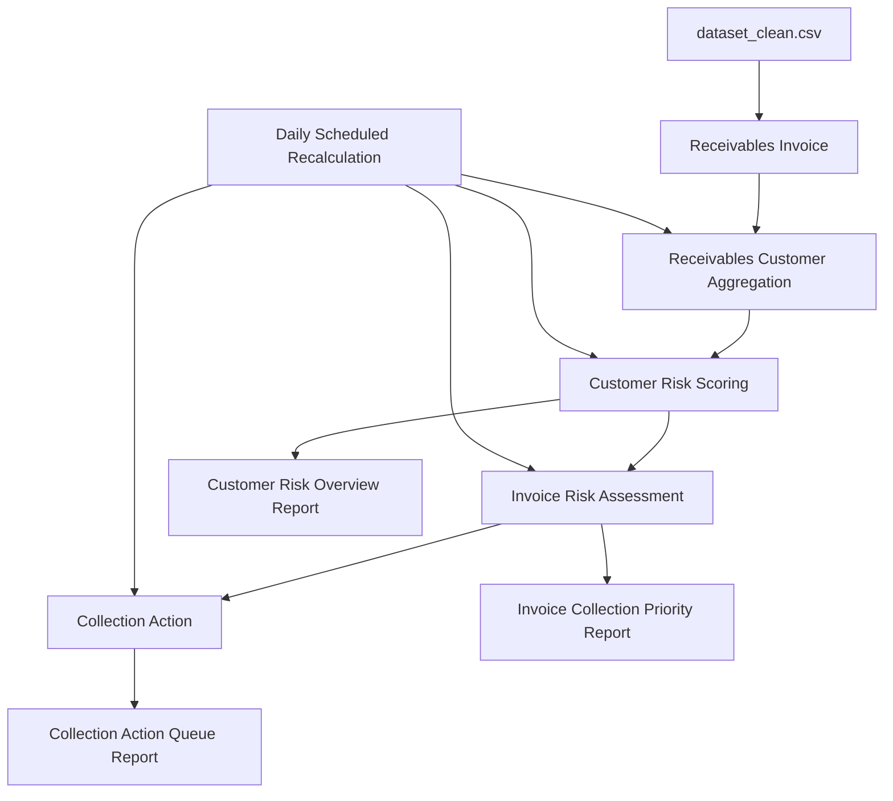

# Receivables Risk Manager

A Frappe/ERPNext app that helps SMEs identify risky customers, prioritize overdue invoices, and generate collection actions using rule-based receivables risk scoring.

Built as a SWE portfolio project for a potential NUS FinTech Lab software engineering role.


## Table of Contents

- [About the Project](#about-the-project)
- [Screenshots](#screenshots)
- [Built With](#built-with)
- [Architecture](#architecture)
- [Features](#features)
- [Design Decisions](#design-decisions)
- [Getting Started](#getting-started)
- [Usage](#usage)
- [Reports](#reports)
- [Testing](#testing)
- [Project Structure](#project-structure)
- [Roadmap](#roadmap)
- [What I Learned](#what-i-learned)
- [License](#license)

## About the Project

Many SMEs know which invoices are overdue, but they often lack a simple way to answer the more useful operational questions:

- Which customers are becoming risky?
- Which open invoices should the finance team prioritize first?
- What collection action should happen next?
- Is a customer risky because of payment history, current exposure, or limited data?

Receivables Risk Manager turns invoice-payment data into a small credit-control workflow inside Frappe:

1. import cleaned invoice data;
2. aggregate invoices by customer;
3. score customer risk;
4. score open invoice risk;
5. generate collection actions;
6. review everything through Script Reports.

This is not a production credit-risk system. It is an MVP-style engineering project focused on data modeling, Frappe conventions, batch processing, explainable scoring, and operational reporting.

## Screenshots

The screenshots below show the main dataset and reporting views in Frappe Desk.

### Imported Receivables Invoice Data


### Aggregated Receivables Customers


### Customer Risk Overview Report


## Built With

- [Frappe Framework v15](https://frappeframework.com/)
- [ERPNext](https://erpnext.com/)
- Python
- MariaDB
- JavaScript
- CSV dataset

## Architecture

The MVP is dataset-driven. It uses custom DocTypes instead of importing directly into ERPNext `Sales Invoice`.



### Core DocTypes

| DocType | Purpose |
| --- | --- |
| `Receivables Invoice` | Stores normalized invoice rows from the cleaned CSV dataset. |
| `Receivables Customer` | Stores customer aggregates, risk score, risk level, and risk confidence. |
| `Risk Settings` | Stores scoring thresholds/weights for future configuration. |
| `Invoice Risk Assessment` | Stores calculated risk for open invoices. |
| `Collection Action` | Stores generated follow-up actions for collection work. |

### Core Pipeline

```text
dataset_clean.csv
→ Receivables Invoice
→ Receivables Customer aggregation
→ Customer Risk Scoring
→ Invoice Risk Assessment
→ Collection Action
→ Reports
→ Scheduled Recalculation
```

## Features

- CSV import of a public receivables invoice dataset.
- Custom normalized DocTypes for analytical invoice-payment data.
- Customer aggregation by `customer_id`.
- Rule-based customer risk scoring.
- Risk confidence for limited payment history.
- Open invoice risk assessment.
- Collection action generation.
- Duplicate-safe collection action creation.
- Stale-record handling when invoices close.
- Script Reports:
  - `Customer Risk Overview`
  - `Invoice Collection Priority`
  - `Collection Action Queue`
- Daily scheduled recalculation pipeline.
- Read-only data quality check.
- Unit tests for pure scoring functions.

## Design Decisions

### Custom DocTypes instead of ERPNext Sales Invoice

The source dataset is analytical invoice-payment data, not a full ERP accounting export. ERPNext `Sales Invoice` requires accounting context such as companies, items, income accounts, taxes, ledgers, and posting rules.

For the MVP, custom DocTypes are a better fit because they:

- keep the project focused on receivables risk analytics;
- avoid creating incomplete accounting documents;
- make the CSV import easier to reason about;
- leave clean room for ERPNext integration later.

Future ERPNext integration could map:

- `Receivables Customer` → ERPNext `Customer`
- `Receivables Invoice` → ERPNext `Sales Invoice`

### Rule-based scoring instead of machine learning

The first version uses deterministic scoring rules rather than ML. That was intentional.

Rule-based scoring is:

- easier to explain to finance users;
- easier to test with unit tests;
- easier to debug in a demo;
- more appropriate before the workflow and data model are stable.

### Historical analysis date

The invoice dataset is historical, so invoice risk is calculated using an analysis date based on the latest `posting_date` in the dataset instead of today’s real date.

This prevents all historical open invoices from becoming artificially overdue just because the project is being run now.

## Getting Started

### Prerequisites

You need a working Frappe/ERPNext v15 bench.

```bash
bench --version
```

You should also have a site available. The examples below use:

```text
staging.local
```

Replace it with your own site name if needed.

### Installation

From your bench directory:

```bash
cd /path/to/frappe-bench
bench get-app https://github.com/<your-username>/receivable_risk_manager.git
bench --site staging.local install-app receivable_risk_manager
bench --site staging.local migrate
bench --site staging.local clear-cache
```

If the app already exists locally:

```bash
cd /path/to/frappe-bench
bench --site staging.local migrate
bench --site staging.local clear-cache
```

### Dataset

The CSV dataset is not committed to this repository. Place the cleaned file locally at:

```text
apps/receivable_risk_manager/ml/data/dataset_clean.csv
```

The `ml/data/` folder is ignored by Git.

## Usage

### 1. Import invoice data

```bash
cd /path/to/frappe-bench
bench --site staging.local execute receivable_risk_manager.imports.invoice_imports.import_dataset \
  --kwargs "{'csv_path': 'apps/receivable_risk_manager/ml/data/dataset_clean.csv'}"
```

For a smaller smoke test:

```bash
bench --site staging.local execute receivable_risk_manager.imports.invoice_imports.import_dataset \
  --kwargs "{'csv_path': 'apps/receivable_risk_manager/ml/data/dataset_clean.csv', 'limit': 1000}"
```

### 2. Run the full recalculation pipeline

```bash
bench --site staging.local execute receivable_risk_manager.tasks.run_full_recalculation
```

The pipeline runs:

1. customer aggregation;
2. customer risk scoring;
3. invoice risk assessment;
4. collection action generation.

Pipeline statuses:

| Status | Meaning |
| --- | --- |
| `success` | All steps completed with no row-level errors. |
| `completed_with_errors` | All major steps completed, but one or more services reported row-level errors. |
| `failed` | A major exception stopped the pipeline. |

### 3. Run the scheduled task manually

```bash
bench --site staging.local execute receivable_risk_manager.tasks.daily_recalculate_receivables_risk
```

Check that the scheduler hook is registered:

```bash
bench --site staging.local execute frappe.get_hooks --args "['scheduler_events']"
```

### 4. Run data quality checks

```bash
bench --site staging.local execute receivable_risk_manager.services.data_quality.validate_receivables_data_quality
```

The check summarizes missing IDs, missing dates, open/closed invoice counts, invalid flags, negative amounts, and inconsistent clear-date/open-status cases.

## Demo Flow

A simple walkthrough for a portfolio demo:

1. Import `dataset_clean.csv`.
2. Run `run_full_recalculation`.
3. Open `Customer Risk Overview`.
   - Show high-risk customers.
   - Explain `risk_score`, `risk_level`, and `risk_confidence`.
4. Open `Invoice Collection Priority`.
   - Show Medium/High-risk open invoices.
   - Explain overdue days, customer risk contribution, invoice exposure, and suggested action.
5. Open `Collection Action Queue`.
   - Show generated follow-up actions sorted by due date and risk score.
6. Run the data quality check.
   - Show that the input data is validated before analytics are trusted.
7. Show the scheduled task hook.
   - Explain how the recalculation pipeline can run daily.

## Reports

### Customer Risk Overview

Source DocType: `Receivables Customer`

Shows customer-level risk and exposure:

- total invoices;
- open invoice count;
- open amount;
- average payment delay;
- late payment rate;
- risk score;
- risk level;
- risk confidence;
- explanation.

### Invoice Collection Priority

Source DocType: `Invoice Risk Assessment`

Shows which open invoices should be prioritized:

- external invoice ID;
- customer;
- due date;
- days overdue;
- invoice amount;
- customer risk score;
- invoice risk score;
- suggested action;
- explanation.

### Collection Action Queue

Source DocType: `Collection Action`

Shows generated follow-up actions:

- action type;
- priority;
- status;
- due date;
- originating risk score;
- notes.

## Testing

The scoring logic is pure Python and can be tested without a Frappe database.

```bash
cd /path/to/frappe-bench/apps/receivable_risk_manager
python3 -m unittest receivable_risk_manager.tests.test_risk_scoring
```

Expected output:

```text
Ran 13 tests

OK
```

## Project Structure

```text
receivable_risk_manager/
  README.md
  license.txt
  pyproject.toml

  receivable_risk_manager/
    hooks.py
    tasks.py

    imports/
      invoice_imports.py

    services/
      customer_aggregation.py
      customer_risk.py
      invoice_risk.py
      collection_actions.py
      risk_scoring.py
      data_quality.py

    tests/
      test_risk_scoring.py

    receivable_risk_manager/
      doctype/
        receivables_invoice/
        receivables_customer/
        risk_settings/
        invoice_risk_assessment/
        collection_action/

      report/
        customer_risk_overview/
        invoice_collection_priority/
        collection_action_queue/
```

## Roadmap

- [x] Import cleaned receivables invoice CSV.
- [x] Aggregate customer metrics.
- [x] Implement rule-based customer risk scoring.
- [x] Implement invoice risk assessment.
- [x] Generate collection actions.
- [x] Add Script Reports.
- [x] Add scheduled recalculation.
- [x] Add data quality checks.
- [x] Add unit tests for scoring.
- [ ] Make scoring weights fully configurable through `Risk Settings`.
- [ ] Add dashboard charts for risk distribution and open exposure.
- [ ] Add a Desk UI flow for CSV upload/import.
- [ ] Add background job support for large imports.
- [ ] Add optional ERPNext `Customer` / `Sales Invoice` mapping.
- [ ] Add sales-order warning based on customer risk.
- [ ] Explore ML-based payment date prediction after the rule-based MVP is stable.

## What I Learned

- How to structure a Frappe app around custom DocTypes, services, reports, and scheduled tasks.
- How to separate pure business logic from Frappe persistence code so scoring can be unit-tested.
- How to design idempotent batch processes that can be safely rerun.
- How to think about stale analytical records when source data changes.
- How to make risk scoring explainable rather than treating it as a black box.
- How to balance ERPNext integration ambitions against the practical scope of an MVP.

## License

Distributed under the MIT License. See `license.txt` for more information.
