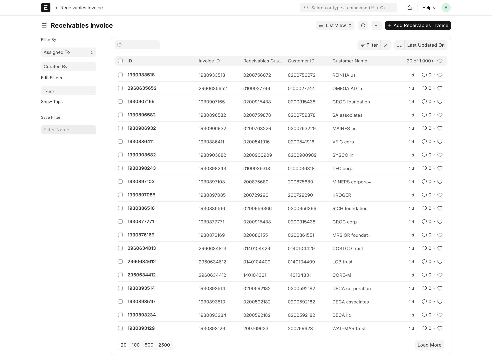
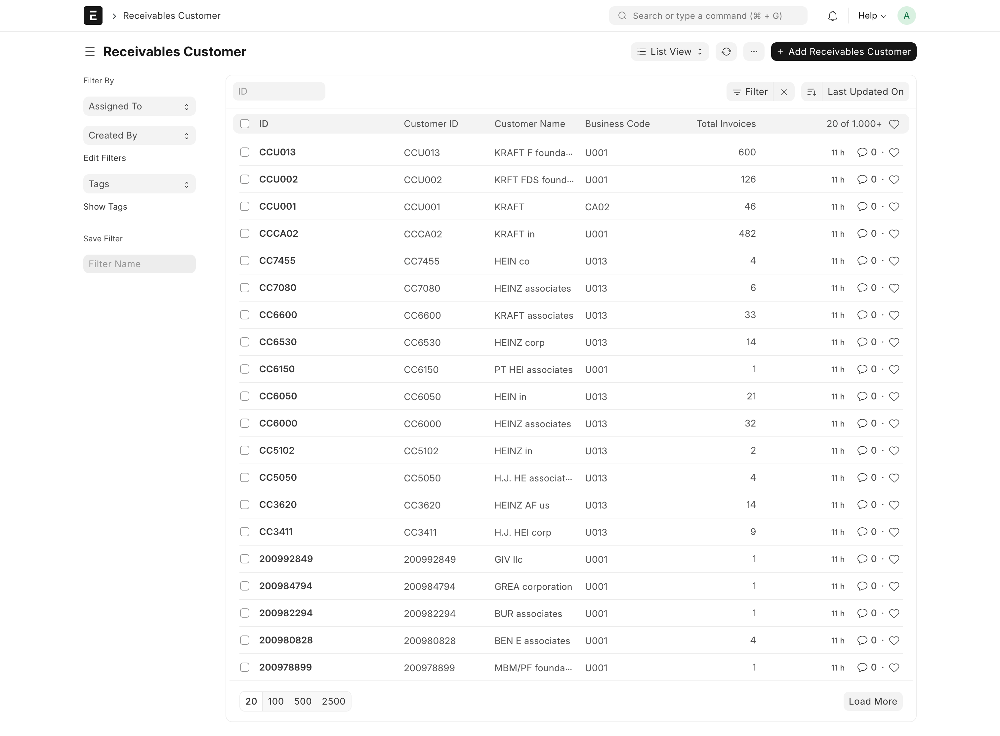
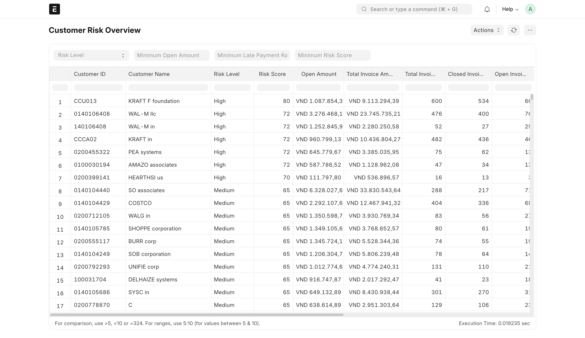
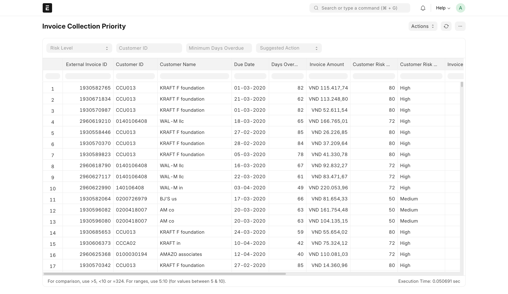
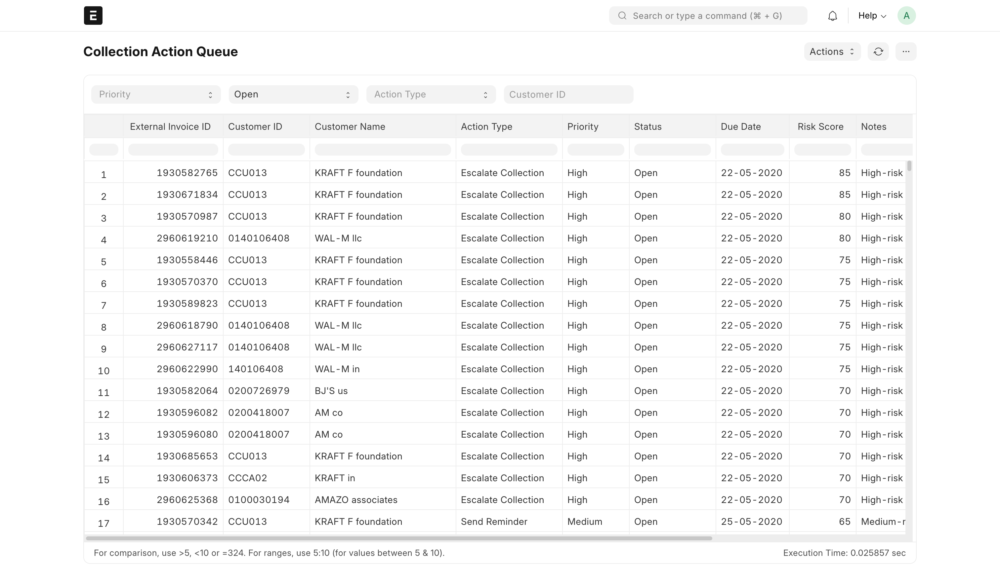
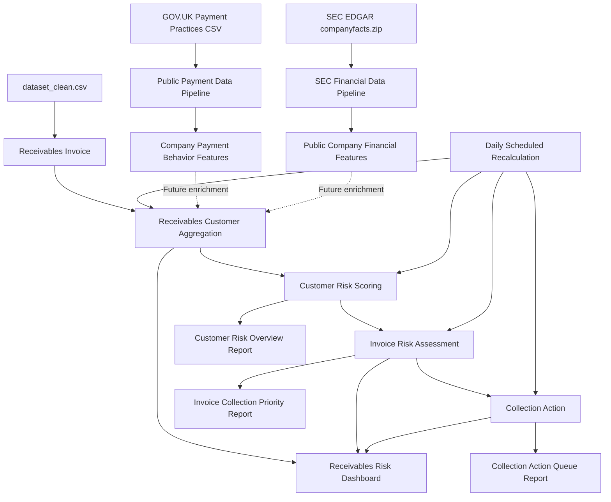

# Receivables Risk Manager

A Frappe/ERPNext app that helps SMEs identify risky customers, prioritize overdue invoices, and generate collection actions using rule-based receivables risk scoring.

Built as a SWE portfolio project for a potential NUS FinTech Lab software engineering role.


## Table of Contents

- [About the Project](#about-the-project)
- [Screenshots](#screenshots)
- [Built With](#built-with)
- [Architecture](#architecture)
- [Features](#features)
- [Design Decisions](#design-decisions)
- [Getting Started](#getting-started)
- [Usage](#usage)
- [Dashboard Analytics](#dashboard-analytics)
- [Phase 2 Public Payment Data](#phase-2-public-payment-data)
- [Phase 2 SEC EDGAR Financial Data](#phase-2-sec-edgar-financial-data)
- [Baseline Public Payment Model](#baseline-public-payment-model)
- [Model Benchmarking](#model-benchmarking)
- [Reports](#reports)
- [Testing](#testing)
- [Project Structure](#project-structure)
- [Roadmap](#roadmap)
- [What I Learned](#what-i-learned)
- [License](#license)

## About the Project

Many SMEs know which invoices are overdue, but they often lack a simple way to answer the more useful operational questions:

- Which customers are becoming risky?
- Which open invoices should the finance team prioritize first?
- What collection action should happen next?
- Is a customer risky because of payment history, current exposure, or limited data?

Receivables Risk Manager turns invoice-payment data into a small credit-control workflow inside Frappe:

1. import cleaned invoice data;
2. aggregate invoices by customer;
3. score customer risk;
4. score open invoice risk;
5. generate collection actions;
6. review everything through dashboard analytics and Script Reports.

This is not a production credit-risk system. It is an MVP-style engineering project focused on data modeling, Frappe conventions, batch processing, explainable scoring, and operational reporting.

## Screenshots

The screenshots below show the main dataset and reporting views in Frappe Desk.

### Imported Receivables Invoice Data



### Aggregated Receivables Customers



### Customer Risk Overview Report



### Invoice Collection Priority Report



### Collection Action Queue Report



### Receivables Risk Dashboard

Screenshot placeholder:

```text
screenshots/receivables-risk-dashboard.png
```

After running the dashboard locally, capture this report view and add the image above for the GitHub portfolio demo.

## Built With

- [Frappe Framework v15](https://frappeframework.com/)
- [ERPNext](https://erpnext.com/)
- Python
- pandas
- MariaDB
- JavaScript
- CSV dataset

## Architecture

The MVP is dataset-driven. It uses custom DocTypes instead of importing directly into ERPNext `Sales Invoice`.



### Core DocTypes

| DocType | Purpose |
| --- | --- |
| `Receivables Invoice` | Stores normalized invoice rows from the cleaned CSV dataset. |
| `Receivables Customer` | Stores customer aggregates, risk score, risk level, and risk confidence. |
| `Receivables Import Job` | Provides a Desk workflow for validating and importing uploaded CSV files. |
| `Risk Settings` | Stores configurable scoring thresholds and coarse risk weights. |
| `Invoice Risk Assessment` | Stores calculated risk for open invoices. |
| `Collection Action` | Stores generated follow-up actions for collection work. |
| `Risk Audit Log` | Stores score/level changes for customer and invoice risk recalculations. |

### Core Pipeline

```text
dataset_clean.csv
→ Receivables Invoice
→ Receivables Customer aggregation
→ Customer Risk Scoring
→ Invoice Risk Assessment
→ Collection Action
→ Reports
→ Scheduled Recalculation
```

## Features

- CSV import of a public receivables invoice dataset.
- Desk-based CSV import job with Validate and Import actions.
- Custom normalized DocTypes for analytical invoice-payment data.
- Customer aggregation by `customer_id`.
- Rule-based customer risk scoring.
- Configurable risk thresholds and weights through `Risk Settings`.
- Risk confidence for limited payment history.
- Open invoice risk assessment.
- Collection action generation.
- Duplicate-safe active collection action creation.
- Stale-record handling when invoices close.
- Basic risk audit log for score and level changes.
- Lightweight DocType validations for core data integrity.
- Script Reports:
  - `Receivables Risk Dashboard`
  - `Customer Risk Overview`
  - `Invoice Collection Priority`
  - `Collection Action Queue`
- Daily scheduled recalculation pipeline.
- Read-only data quality check.
- GOV.UK public payment practices data processing for future company-level enrichment.
- SEC EDGAR financial facts processing for future public-company financial enrichment.
- ML-ready company payment behavior dataset generation.
- Unit tests for pure scoring functions.
- Frappe integration tests for the core risk workflow.

## Design Decisions

### Custom DocTypes instead of ERPNext Sales Invoice

The source dataset is analytical invoice-payment data, not a full ERP accounting export. ERPNext `Sales Invoice` requires accounting context such as companies, items, income accounts, taxes, ledgers, and posting rules.

For the MVP, custom DocTypes are a better fit because they:

- keep the project focused on receivables risk analytics;
- avoid creating incomplete accounting documents;
- make the CSV import easier to reason about;
- leave clean room for ERPNext integration later.

Future ERPNext integration could map:

- `Receivables Customer` → ERPNext `Customer`
- `Receivables Invoice` → ERPNext `Sales Invoice`

### Rule-based scoring instead of machine learning

The first version uses deterministic scoring rules rather than ML. That was intentional.

Rule-based scoring is:

- easier to explain to finance users;
- easier to test with unit tests;
- easier to debug in a demo;
- more appropriate before the workflow and data model are stable.

### Historical analysis date

The invoice dataset is historical, so invoice risk is calculated using an analysis date based on the latest `posting_date` in the dataset instead of today’s real date.

This prevents all historical open invoices from becoming artificially overdue just because the project is being run now.

## Getting Started

### Prerequisites

You need a working Frappe/ERPNext v15 bench.

```bash
bench --version
```

You should also have a site available. The examples below use:

```text
staging.local
```

Replace it with your own site name if needed.

### Installation

From your bench directory:

```bash
cd /path/to/frappe-bench
bench get-app https://github.com/<your-username>/receivable_risk_manager.git
bench --site staging.local install-app receivable_risk_manager
bench --site staging.local migrate
bench --site staging.local clear-cache
```

If the app already exists locally:

```bash
cd /path/to/frappe-bench
bench --site staging.local migrate
bench --site staging.local clear-cache
```

### Dataset

The CSV dataset is not committed to this repository. Place the cleaned file locally at:

```text
apps/receivable_risk_manager/ml/data/dataset_clean.csv
```

The `ml/data/` folder is ignored by Git.

## Usage

### 1. Import invoice data from Desk

For a finance-user-friendly workflow:

1. Open `Receivables Import Job`.
2. Create a new job.
3. Attach `dataset_clean.csv`.
4. Save.
5. Click `Validate`.
6. Review total rows, valid rows, invalid rows, and error summary.
7. Click `Import`.

The import job imports valid rows, skips invalid rows, and runs the receivables risk recalculation pipeline after a successful import.

### 2. Import invoice data from CLI

The command-line importer is still available for development and repeatable local demos:

```bash
cd /path/to/frappe-bench
bench --site staging.local execute receivable_risk_manager.imports.invoice_imports.import_dataset \
  --kwargs "{'csv_path': 'apps/receivable_risk_manager/ml/data/dataset_clean.csv'}"
```

For a smaller smoke test:

```bash
bench --site staging.local execute receivable_risk_manager.imports.invoice_imports.import_dataset \
  --kwargs "{'csv_path': 'apps/receivable_risk_manager/ml/data/dataset_clean.csv', 'limit': 1000}"
```

### 3. Run the full recalculation pipeline

```bash
bench --site staging.local execute receivable_risk_manager.tasks.run_full_recalculation
```

The pipeline runs:

1. customer aggregation;
2. customer risk scoring;
3. invoice risk assessment;
4. collection action generation.

Pipeline statuses:

| Status | Meaning |
| --- | --- |
| `success` | All steps completed with no row-level errors. |
| `completed_with_errors` | All major steps completed, but one or more services reported row-level errors. |
| `failed` | A major exception stopped the pipeline. |

### 4. Run the scheduled task manually

```bash
bench --site staging.local execute receivable_risk_manager.tasks.daily_recalculate_receivables_risk
```

Check that the scheduler hook is registered:

```bash
bench --site staging.local execute frappe.get_hooks --args "['scheduler_events']"
```

### 5. Run data quality checks

```bash
bench --site staging.local execute receivable_risk_manager.services.data_quality.validate_receivables_data_quality
```

The check summarizes missing IDs, missing dates, open/closed invoice counts, invalid flags, negative amounts, and inconsistent clear-date/open-status cases.

## Demo Workflow and Commands

This is the workflow I use for a local portfolio demo on a Frappe site named `staging.local`.

### 1. Start the bench

In one terminal:

```bash
cd /path/to/frappe-bench
bench start
```

Then open the site in the browser and log in:

```text
http://staging.local:8000
```

If your local site uses a different port or hostname, use that instead.

### 2. Import the cleaned dataset from Desk

In Frappe Desk:

1. Search for `Receivables Import Job`.
2. Create a new import job.
3. Attach the cleaned CSV file.
4. Save the job.
5. Click `Validate`.
6. Review the validation summary and error summary.
7. Click `Import`.

What this demonstrates:

- finance users can validate and import CSV data without running terminal commands;
- invalid rows are summarized instead of silently imported;
- valid rows are imported through the same idempotent importer used by the CLI path;
- the risk recalculation pipeline runs after import.

### 3. Optional CLI import path

In a second terminal:

```bash
cd /path/to/frappe-bench
bench --site staging.local execute receivable_risk_manager.imports.invoice_imports.import_dataset \
  --kwargs "{'csv_path': 'apps/receivable_risk_manager/ml/data/dataset_clean.csv'}"
```

For a faster demo reset or smoke test, import a smaller slice:

```bash
bench --site staging.local execute receivable_risk_manager.imports.invoice_imports.import_dataset \
  --kwargs "{'csv_path': 'apps/receivable_risk_manager/ml/data/dataset_clean.csv', 'limit': 1000}"
```

What this demonstrates:

- raw CSV invoice rows become `Receivables Invoice` records;
- the app avoids forcing analytical data into ERPNext accounting documents.

### 4. Run the full recalculation pipeline

```bash
bench --site staging.local execute receivable_risk_manager.tasks.run_full_recalculation
```

What this demonstrates:

- invoices are aggregated into `Receivables Customer`;
- customer risk is scored;
- open invoices are assessed;
- collection actions are generated;
- the pipeline can be safely rerun.

### 5. Run the data quality check

```bash
bench --site staging.local execute receivable_risk_manager.services.data_quality.validate_receivables_data_quality
```

What this demonstrates:

- the project checks data assumptions before trusting the analytics;
- the check is read-only and safe to run repeatedly.

### 6. Verify the scheduled job hook

```bash
bench --site staging.local execute frappe.get_hooks --args "['scheduler_events']"
```

You can also manually run the scheduled function:

```bash
bench --site staging.local execute receivable_risk_manager.tasks.daily_recalculate_receivables_risk
```

What this demonstrates:

- the same recalculation pipeline is registered for daily scheduled execution;
- new or changed invoice data can be picked up by the next scheduled run.

### 7. Walk through the Frappe Desk UI

A concise demo path:

1. Create a `Receivables Import Job`.
2. Attach `dataset_clean.csv`, then click `Validate`.
3. Click `Import`.
4. Open the `Receivables Invoice` list.
   - Show the normalized invoice dataset imported into Frappe.
5. Open the `Receivables Customer` list.
   - Show customer-level aggregates such as total invoices and open exposure.
6. Open `Receivables Risk Dashboard`.
   - Show KPI summary cards for customers, exposure, risky invoices, and collection actions.
   - Switch the chart metric between outstanding amount by risk level, aging bucket distribution, and collection actions by status.
7. Open `Customer Risk Overview`.
   - Show high-risk customers.
   - Explain `risk_score`, `risk_level`, and `risk_confidence`.
8. Open `Invoice Collection Priority`.
   - Show Medium/High-risk open invoices.
   - Explain overdue days, customer risk contribution, invoice exposure, and suggested action.
9. Open `Collection Action Queue`.
   - Show generated follow-up actions sorted by due date and risk score.
10. Show the terminal output from the data quality check and scheduler hook.
   - Explain how the workflow becomes repeatable instead of being a one-time script.

## Dashboard Analytics

`Receivables Risk Dashboard` is a dashboard-style Script Report for finance users who need a quick visual summary before drilling into detailed reports.

It includes:

- KPI summary cards for total customers, high-risk customers, open exposure, risky open invoices, and collection workload.
- Chart options for:
  - outstanding amount by risk level;
  - customer risk distribution;
  - aging bucket distribution;
  - collection actions by status;
  - open overdue exposure by due month.
- A Top Risky Customers table sorted by risk score and open exposure.

The dashboard intentionally uses Frappe-native reporting instead of a custom frontend. This keeps the MVP maintainable and makes the analytics easy to inspect, test, and explain.

Monthly overdue analytics are based on the historical dataset and should be interpreted as open overdue exposure grouped by due month, not as a live month-by-month accounting snapshot.

## Phase 2 Public Payment Data

Phase 2 adds a separate public-data processing layer for predictive receivables intelligence.

Source:

```text
GOV.UK payment practices and performance reporting dataset
```

This dataset is public company/reporting-period data. It is not invoice-level ERP data and should not be imported into `Receivables Invoice`.

The public dataset contains fields such as:

- average time to pay;
- percentage of invoices paid within 30 days;
- percentage of invoices paid between 31 and 60 days;
- percentage of invoices paid later than 60 days;
- percentage not paid within agreed terms;
- reported paid invoice value buckets, when available;
- payment terms;
- e-invoicing and supply-chain financing indicators.

The processing pipeline turns the raw public CSV into company-level payment behavior features:

```text
ml/data/raw/2026-06-25-1620-prompt-payments.csv
→ public payment data cleaning
→ data quality report
→ company payment behavior features
→ ML-ready slow-payer labels
```

Run the processor from the app directory:

```bash
cd /path/to/frappe-bench/apps/receivable_risk_manager
python3 -m receivable_risk_manager.ml.public_payment_data \
  --input ml/data/raw/2026-06-25-1620-prompt-payments.csv \
  --output-dir ml/data/processed
```

Generated outputs:

```text
ml/data/processed/public_payment_cleaned.csv
ml/data/processed/public_payment_flagged_rows.csv
ml/data/processed/public_payment_ml_ready.csv
ml/data/processed/public_payment_quality_report.json
```

Important limitations:

- This data is company/reporting-period level, not individual invoice-level data.
- It should be used as a future enrichment layer for customer payment behavior, not as a replacement for ERP invoice records.
- ERP invoice amount and open exposure still come from the app’s `Receivables Invoice` and `Receivables Customer` data.
- Value-derived features are named as reported public-payment values, for example `reported_paid_invoice_value`, not invoice totals.
- The labels `slow_payer_label` and `late_terms_label` are payment behavior labels, not default-risk labels.

## Phase 2 SEC EDGAR Financial Data

SEC EDGAR is used as a large public-company financial enrichment source. This is separate from the receivables invoice dataset.

Source:

```text
SEC EDGAR companyfacts bulk data
https://www.sec.gov/Archives/edgar/daily-index/xbrl/companyfacts.zip
```

The SEC dataset contains company-level XBRL financial facts. It is not customer invoice history, so this app treats it as future enrichment data rather than importing it into `Receivables Invoice`.

The SEC pipeline extracts financial profile features such as:

- revenue;
- cash and cash equivalents;
- current assets and current liabilities;
- total assets and total liabilities;
- accounts payable;
- operating income and net income;
- current ratio;
- cash-to-current-liabilities ratio;
- liabilities-to-assets ratio;
- accounts-payable-to-revenue ratio;
- simple SEC financial risk band.

Download SEC bulk data outside git:

```bash
cd /path/to/frappe-bench/apps/receivable_risk_manager
mkdir -p ml/data/raw/sec ml/data/processed
curl -L \
  -H "User-Agent: ReceivablesRiskManager/0.1 contact@example.com" \
  https://www.sec.gov/Archives/edgar/daily-index/xbrl/companyfacts.zip \
  -o ml/data/raw/sec/companyfacts.zip
```

Run a small sample first:

```bash
python3 -m receivable_risk_manager.ml.sec_edgar_data \
  --input ml/data/raw/sec/companyfacts.zip \
  --output ml/data/processed/sec_company_financial_profiles_sample.csv \
  --limit 100
```

Run the full processor:

```bash
python3 -m receivable_risk_manager.ml.sec_edgar_data \
  --input ml/data/raw/sec/companyfacts.zip \
  --output ml/data/processed/sec_company_financial_profiles.csv
```

Create a read-only quality report:

```bash
python3 -m receivable_risk_manager.ml.sec_edgar_quality \
  --input ml/data/processed/sec_company_financial_profiles.csv \
  --output ml/data/processed/sec_company_financial_profiles_quality_report.json
```

Important limitations:

- SEC EDGAR mostly covers public companies and SEC filers, not all SME customers.
- Matching app customers to SEC companies requires a later identity-matching layer.
- Financial statements are periodic and lagged; they should enrich risk context, not replace invoice-level behavior.
- The current SEC risk band is intentionally simple and explainable. It is a starting point for analysis, not a credit decision model.
- SEC company facts can have missing concepts or mixed reporting periods, so the quality report should be reviewed before model training.

## Baseline Public Payment Model

The first ML component is an offline baseline model trained only on the GOV.UK public payment practices dataset. Logistic Regression is kept as the simple explainable baseline; the broader benchmark below selects the final model.

Prediction target:

```text
slow_payer_label
```

This label is created from public payment behavior:

```text
slow_payer_label = 1 if avg_days_to_pay > 60 else 0
```

To avoid target leakage, the model does not use `avg_days_to_pay` as an input feature.

Feature set:

```text
pct_paid_within_30
pct_paid_31_60
pct_paid_later_60
pct_not_paid_within_terms
pct_not_paid_due_to_dispute
shortest_standard_payment_period
longest_standard_payment_period
maximum_contractual_payment_period
company_reporting_count
payment_terms_changed_flag
payment_terms_changed_covid_related
payment_terms_changed_policy_related
payment_terms_changed_supplier_related
e_invoicing_offered
supply_chain_financing_offered
participates_in_payment_codes
```

The raw `payment_terms_have_changed` field is retained in the processed dataset for auditability. For modeling, it is normalized into stable derived features so the model does not learn directly from high-variance free-text explanations.

The split is company-based, not row-based:

```text
80% companies for training
20% companies for testing
```

This prevents the same `company_number` from appearing in both train and test sets.

Train the baseline model:

```bash
cd /path/to/frappe-bench/apps/receivable_risk_manager
python3 -m receivable_risk_manager.ml.train_public_payment_model \
  --input ml/data/processed/public_payment_ml_ready.csv \
  --output-dir ml/artifacts/public_payment_model \
  --threshold-report ml/data/processed/public_payment_threshold_report.csv \
  --test-size 0.2 \
  --random-state 42 \
  --recall-floor 0.8
```

Generated local artifacts:

```text
ml/artifacts/public_payment_model/public_payment_model.joblib
ml/artifacts/public_payment_model/model_metrics.json
ml/artifacts/public_payment_model/training_columns.json
ml/artifacts/public_payment_model/feature_importance.csv
ml/artifacts/public_payment_model/threshold_config.json
ml/artifacts/public_payment_model/calibration_metrics.json
ml/data/processed/public_payment_threshold_report.csv
```

These artifacts are ignored by git because they are generated locally.

Example training result from the current dataset:

```text
rows used: 101,439
positive label rate: 8.52%
train companies: 7,548
test companies: 1,888
group overlap: 0
baseline model: logistic_regression_balanced
```

Metrics:

| Model | Accuracy | Precision | Recall | F1 | ROC AUC |
| --- | ---: | ---: | ---: | ---: | ---: |
| Logistic Regression balanced | 0.8999 | 0.6099 | 0.8106 | 0.6961 | 0.9654 |
| Random Forest balanced | 0.8704 | 0.4570 | 0.8775 | 0.6010 | 0.9465 |

Threshold tuning evaluates thresholds from `0.20` to `0.80`. The current strategy selects the highest-F1 threshold that still keeps recall at or above `0.80`.

Current selected threshold:

```text
selected threshold: 0.75
precision: 0.6099
recall: 0.8106
F1: 0.6961
```

Calibration is evaluated with a Brier score and 10-bin calibration curve. The current model records calibration metrics but does not yet replace the classifier with `CalibratedClassifierCV`.

Current calibration:

```text
Brier score: 0.075738
```

The prediction layer loads the final benchmark model from:

```text
ml/artifacts/public_payment_model/best_model.joblib
```

It returns:

- slow-payer probability;
- selected decision threshold;
- predicted label;
- Low / Medium / High risk band;
- top explanation drivers;
- feature snapshot used for prediction;
- model version and artifact path.

For the selected Logistic Regression model, explanations use coefficient-based local contributions. If a future tree/boosting model is selected, explanations fall back to global feature importance.

This model is not yet used inside the Frappe app. For now it is a research/prototype component that can later provide an external slow-payer probability signal.

Possible future `Receivables Customer` fields:

```text
public_payment_risk_score
public_payment_risk_band
public_payment_prediction_explanation
public_payment_model_version
public_payment_last_updated
public_payment_source_company_number
```

The rule-based score should remain the stable operational core. A future combined score could use the ML output as a smaller external enrichment signal after company matching is validated.

Limitations:

- GOV.UK public payment data is company/reporting-period level, not invoice-level ERP data.
- The model predicts public slow-payer behavior, not invoice default.
- Some current features are same-period payment behavior indicators, so this is a classification/enrichment baseline.
- The raw payment-terms change text is normalized into compact derived features before modeling, but other public-reporting fields may still need future feature refinement.
- A stronger future model should use period `T` features to predict period `T+1` slow-payer labels.

## Model Benchmarking

To avoid assuming that a more complex model is automatically better, the ML layer includes a Stage A benchmark across viable scikit-learn models.

Run the benchmark:

```bash
cd /path/to/frappe-bench/apps/receivable_risk_manager
../../env/bin/python -m receivable_risk_manager.ml.model_benchmark \
  --input ml/data/processed/public_payment_ml_ready.csv \
  --output-dir ml/artifacts/public_payment_model \
  --processed-dir ml/data/processed \
  --test-size 0.2 \
  --random-state 42 \
  --recall-floor 0.8
```

Generated local benchmark artifacts:

```text
ml/data/processed/model_benchmark_results.csv
ml/data/processed/model_benchmark_results.json
ml/data/processed/model_threshold_reports/
ml/artifacts/public_payment_model/model_comparison.md
ml/artifacts/public_payment_model/best_model.joblib
ml/artifacts/public_payment_model/selected_threshold.json
```

Benchmark selection rule:

1. prefer models with recall `>= 0.80`;
2. maximize F1 under that recall constraint;
3. prefer higher precision and PR AUC;
4. prefer better calibration and simpler deployment;
5. keep Logistic Regression unless another model improves F1 by at least `0.02` or gives a materially better precision/recall tradeoff.

Stage A benchmark results:

| Model | Precision | Recall | F1 | ROC AUC | PR AUC | Brier | Threshold |
| --- | ---: | ---: | ---: | ---: | ---: | ---: | ---: |
| CatBoost | 0.6340 | 0.8111 | 0.7117 | 0.9691 | 0.8283 | 0.0726 | 0.75 |
| XGBoost | 0.6270 | 0.8085 | 0.7062 | 0.9691 | 0.8246 | 0.0731 | 0.75 |
| LightGBM | 0.6118 | 0.8315 | 0.7049 | 0.9702 | 0.8269 | 0.0677 | 0.70 |
| Logistic Regression balanced | 0.6099 | 0.8106 | 0.6961 | 0.9654 | 0.8105 | 0.0757 | 0.75 |
| SGD log-loss balanced | 0.6099 | 0.8074 | 0.6949 | 0.9635 | 0.8027 | 0.0755 | 0.75 |
| Logistic Regression unweighted | 0.6014 | 0.8106 | 0.6905 | 0.9643 | 0.8105 | 0.0357 | 0.20 |
| Decision Tree balanced | 0.5944 | 0.8186 | 0.6887 | 0.9544 | 0.7910 | 0.0771 | 0.75 |
| Ridge Classifier balanced | 0.4983 | 0.8780 | 0.6358 | 0.9637 | 0.8082 | N/A | N/A |
| Linear SVC balanced | 0.4831 | 0.8957 | 0.6277 | 0.9653 | 0.8099 | N/A | N/A |
| Random Forest balanced | 0.4570 | 0.8775 | 0.6010 | 0.9465 | 0.6563 | 0.1463 | 0.55 |
| Extra Trees balanced | 0.4557 | 0.8363 | 0.5899 | 0.9422 | 0.6554 | 0.1477 | 0.55 |

Final selection:

```text
Logistic Regression balanced
```

Reason:

```text
After categorical cleanup, CatBoost, XGBoost, and LightGBM improved F1 slightly,
but none exceeded the required +0.02 F1 improvement over Logistic Regression
while preserving recall above 0.80.
Logistic Regression remains the selected explainable baseline.
```

Skipped models:

- Gaussian Naive Bayes: dense array requirement is not a good default for the mixed numeric/categorical pipeline.
- Gradient Boosting / HistGradientBoosting / AdaBoost: skipped because the existing sparse-friendly baselines are a better runtime/accuracy tradeoff.
- Kernel SVC / KNN: runtime and inference costs are not appropriate for this dataset size.

Deep learning is not prioritized because this is tabular, imbalanced finance data where linear/tree models are easier to explain, deploy, and audit.

## Reports

### Receivables Risk Dashboard

Sources:

- `Receivables Customer`
- `Invoice Risk Assessment`
- `Collection Action`

Shows dashboard-ready finance analytics:

- risk level distribution;
- outstanding amount by risk level;
- aging bucket distribution;
- top risky customers;
- collection actions by status;
- open overdue exposure by due month.

### Customer Risk Overview

Source DocType: `Receivables Customer`

Shows customer-level risk and exposure:

- total invoices;
- open invoice count;
- open amount;
- average payment delay;
- late payment rate;
- risk score;
- risk level;
- risk confidence;
- explanation.

### Invoice Collection Priority

Source DocType: `Invoice Risk Assessment`

Shows which open invoices should be prioritized:

- external invoice ID;
- customer;
- due date;
- days overdue;
- invoice amount;
- customer risk score;
- invoice risk score;
- suggested action;
- explanation.

### Collection Action Queue

Source DocType: `Collection Action`

Shows generated follow-up actions:

- action type;
- priority;
- status;
- due date;
- originating risk score;
- notes.

## Testing

The scoring, dashboard helper, CSV validation, and public-payment processing logic can be tested without a Frappe database.

```bash
cd /path/to/frappe-bench/apps/receivable_risk_manager
../../env/bin/python -m unittest \
  receivable_risk_manager.tests.test_risk_scoring \
  receivable_risk_manager.tests.test_dashboard_metrics \
  receivable_risk_manager.tests.test_import_jobs \
  receivable_risk_manager.tests.test_public_payment_data \
  receivable_risk_manager.tests.test_public_payment_quality \
  receivable_risk_manager.tests.test_public_payment_features \
  receivable_risk_manager.tests.test_sec_edgar_data \
  receivable_risk_manager.tests.test_sec_edgar_features \
  receivable_risk_manager.tests.test_sec_edgar_quality \
  receivable_risk_manager.tests.test_public_payment_thresholds \
  receivable_risk_manager.tests.test_public_payment_predictor \
  receivable_risk_manager.tests.test_model_benchmark \
  receivable_risk_manager.tests.test_train_public_payment_model
```

Expected output:

```text
Ran 64 tests

OK
```

The Frappe workflow tests require a migrated Frappe site:

```bash
cd /path/to/frappe-bench
bench --site staging.local run-tests --app receivable_risk_manager
```

## Project Structure

```text
receivable_risk_manager/
  README.md
  license.txt
  pyproject.toml

  receivable_risk_manager/
    hooks.py
    tasks.py

    imports/
      invoice_imports.py

    ml/
      public_payment_data.py
      public_payment_features.py
      public_payment_thresholds.py
      public_payment_predictor.py
      model_benchmark.py
      sec_edgar_data.py
      sec_edgar_features.py
      data_quality.py
      train_public_payment_model.py

    services/
      risk_settings.py
      customer_aggregation.py
      customer_risk.py
      invoice_risk.py
      collection_actions.py
      risk_scoring.py
      risk_audit.py
      data_quality.py
      dashboard_metrics.py
      import_jobs.py

    tests/
      test_risk_scoring.py
      test_dashboard_metrics.py
      test_import_jobs.py
      test_public_payment_data.py
      test_public_payment_features.py
      test_public_payment_quality.py
      test_public_payment_thresholds.py
      test_public_payment_predictor.py
      test_model_benchmark.py
      test_sec_edgar_data.py
      test_sec_edgar_features.py
      test_sec_edgar_quality.py
      test_train_public_payment_model.py
      test_receivables_workflow.py

    receivable_risk_manager/
      doctype/
        receivables_invoice/
        receivables_customer/
        receivables_import_job/
        risk_settings/
        invoice_risk_assessment/
        collection_action/
        risk_audit_log/

      report/
        receivables_risk_dashboard/
        customer_risk_overview/
        invoice_collection_priority/
        collection_action_queue/
```

## Roadmap

- [x] Import cleaned receivables invoice CSV.
- [x] Aggregate customer metrics.
- [x] Implement rule-based customer risk scoring.
- [x] Implement invoice risk assessment.
- [x] Generate collection actions.
- [x] Add Script Reports.
- [x] Add scheduled recalculation.
- [x] Add data quality checks.
- [x] Add unit tests for scoring.
- [x] Make scoring thresholds and coarse weights configurable through `Risk Settings`.
- [x] Add basic risk audit logging.
- [x] Add Frappe workflow integration test coverage.
- [x] Add dashboard-ready analytics report for risk distribution, exposure, aging, and collection workload.
- [x] Add a Desk UI flow for CSV upload/import.
- [x] Process GOV.UK public payment practices data into company-level ML-ready features.
- [x] Process SEC EDGAR company facts into company-level financial enrichment features.
- [x] Train an offline baseline public payment behavior model with company-based train/test split.
- [x] Benchmark viable scikit-learn models and keep Logistic Regression unless another model improves materially.
- [ ] Add background job support for large imports.
- [ ] Add optional ERPNext `Customer` / `Sales Invoice` mapping.
- [ ] Add sales-order warning based on customer risk.
- [ ] Train a baseline public payment behavior model after the processed dataset is reviewed.
- [ ] Explore ML-based payment date prediction after the rule-based MVP is stable.

## What I Learned

- How to structure a Frappe app around custom DocTypes, services, reports, and scheduled tasks.
- How to separate pure business logic from Frappe persistence code so scoring can be unit-tested.
- How to design idempotent batch processes that can be safely rerun.
- How to think about stale analytical records when source data changes.
- How to make risk scoring explainable rather than treating it as a black box.
- How to balance ERPNext integration ambitions against the practical scope of an MVP.

## License

Distributed under the MIT License. See `license.txt` for more information.
