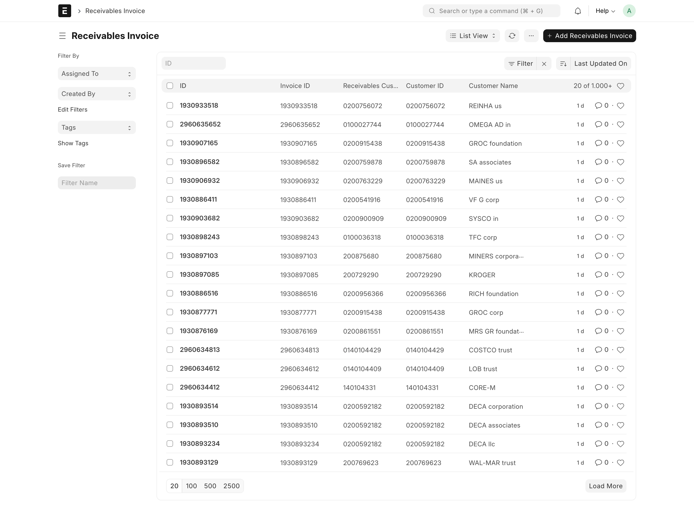
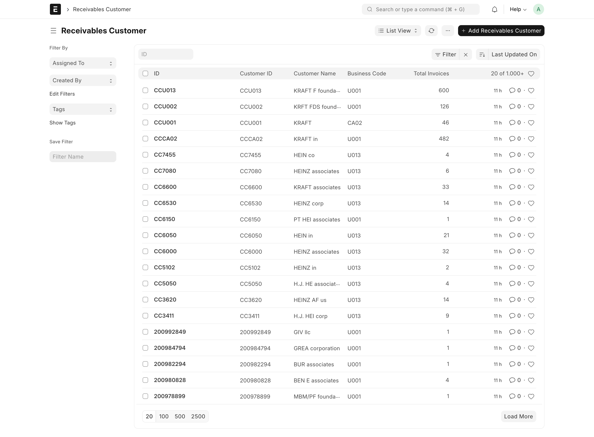
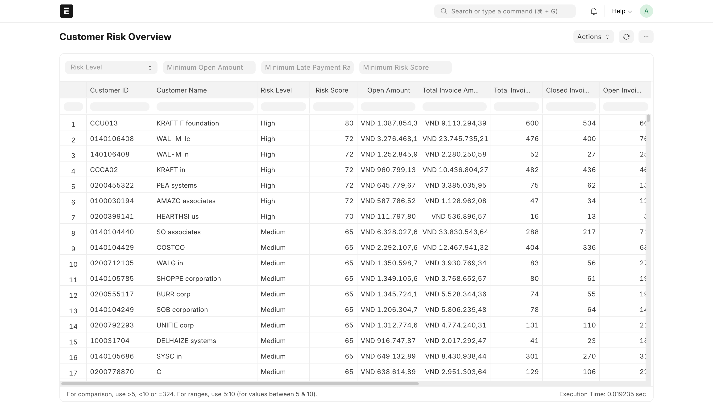
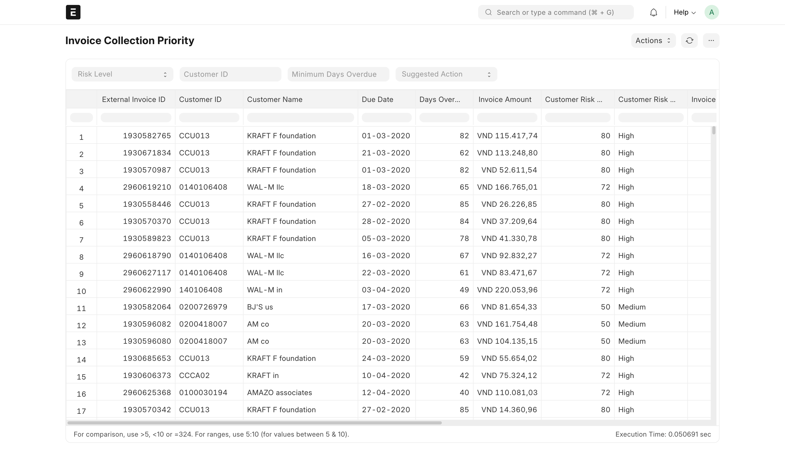
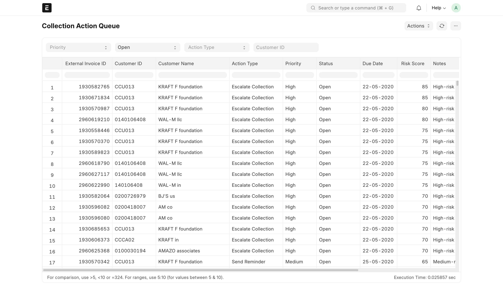
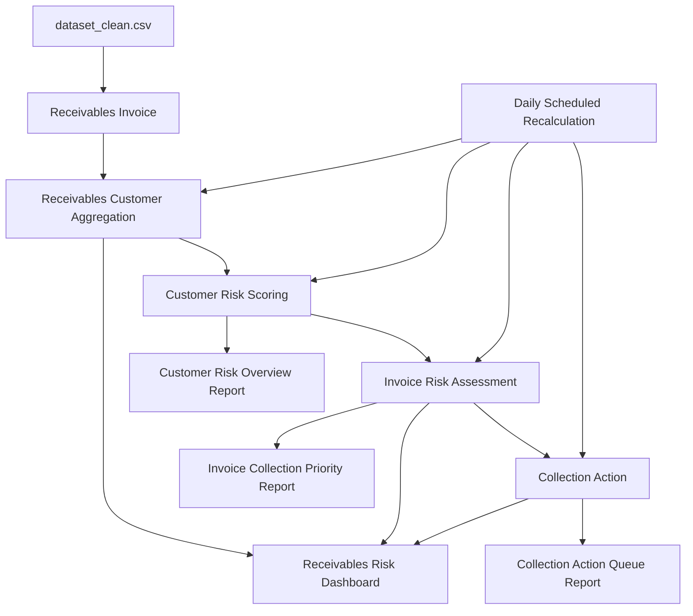

# Receivables Risk Manager

A Frappe/ERPNext app that helps SMEs identify risky customers, prioritize overdue invoices, and generate collection actions using rule-based receivables risk scoring.

Built as a SWE portfolio project for a potential NUS FinTech Lab software engineering role.


## Table of Contents

- [About the Project](#about-the-project)
- [Screenshots](#screenshots)
- [Built With](#built-with)
- [Architecture](#architecture)
- [Features](#features)
- [Design Decisions](#design-decisions)
- [Getting Started](#getting-started)
- [Usage](#usage)
- [Dashboard Analytics](#dashboard-analytics)
- [Reports](#reports)
- [Testing](#testing)
- [Project Structure](#project-structure)
- [Roadmap](#roadmap)
- [What I Learned](#what-i-learned)
- [License](#license)

## About the Project

Many SMEs know which invoices are overdue, but they often lack a simple way to answer the more useful operational questions:

- Which customers are becoming risky?
- Which open invoices should the finance team prioritize first?
- What collection action should happen next?
- Is a customer risky because of payment history, current exposure, or limited data?

Receivables Risk Manager turns invoice-payment data into a small credit-control workflow inside Frappe:

1. import cleaned invoice data;
2. aggregate invoices by customer;
3. score customer risk;
4. score open invoice risk;
5. generate collection actions;
6. review everything through dashboard analytics and Script Reports.

This is not a production credit-risk system. It is an MVP-style engineering project focused on data modeling, Frappe conventions, batch processing, explainable scoring, and operational reporting.

## Screenshots

The screenshots below show the main dataset and reporting views in Frappe Desk.
See [`docs/screenshot_checklist.md`](docs/screenshot_checklist.md) for the
click-by-click capture order used to produce these.

### Imported Receivables Invoice Data



### Aggregated Receivables Customers



### Customer Risk Overview Report



### Invoice Collection Priority Report



### Collection Action Queue Report



### Receivables Risk Dashboard

Screenshot placeholder:

```text
screenshots/receivables-risk-dashboard.png
```

After running the dashboard locally, capture this report view and add the image above for the GitHub portfolio demo.

## Built With

- [Frappe Framework v15](https://frappeframework.com/)
- [ERPNext](https://erpnext.com/)
- Python
- MariaDB
- JavaScript
- CSV dataset

## Architecture

The MVP is dataset-driven. It uses custom DocTypes instead of importing directly into ERPNext `Sales Invoice`.


```mermaid
flowchart TD
    A[dataset_clean.csv] --> B[Receivables Invoice]
    B --> C[Receivables Customer Aggregation]
    C --> D[Customer Risk Scoring]
    D --> E[Invoice Risk Assessment]
    E --> F[Collection Action]
    C --> K[Receivables Risk Dashboard]
    E --> K
    F --> K
    D --> G[Customer Risk Overview Report]
    E --> H[Invoice Collection Priority Report]
    F --> I[Collection Action Queue Report]
    J[Daily Scheduled Recalculation] --> C
    J --> D
    J --> E
    J --> F
```

### Core DocTypes

| DocType | Purpose |
| --- | --- |
| `Receivables Invoice` | Stores normalized invoice rows from the cleaned CSV dataset. |
| `Receivables Customer` | Stores customer aggregates, risk score, risk level, and risk confidence. |
| `Receivables Import Job` | Provides a Desk workflow for validating and importing uploaded CSV files. |
| `Risk Settings` | Stores configurable scoring thresholds and coarse risk weights. |
| `Invoice Risk Assessment` | Stores calculated risk for open invoices. |
| `Collection Action` | Stores generated follow-up actions for collection work. |
| `Risk Audit Log` | Stores score/level changes for customer and invoice risk recalculations. |

### Core Pipeline

```text
dataset_clean.csv
→ Receivables Invoice
→ Receivables Customer aggregation
→ Customer Risk Scoring
→ Invoice Risk Assessment
→ Collection Action
→ Reports
→ Scheduled Recalculation
```

## Features

- CSV import of a public receivables invoice dataset.
- Desk-based CSV import job with Validate and Import actions.
- Background-queued import and recalculation for large CSV files, with a realtime Desk notification when the job finishes.
- Custom normalized DocTypes for analytical invoice-payment data.
- Customer aggregation by `customer_id`.
- Rule-based customer risk scoring.
- Configurable risk thresholds and weights through `Risk Settings`.
- Risk confidence for limited payment history.
- Open invoice risk assessment.
- Collection action generation.
- Duplicate-safe active collection action creation.
- Enforced `Collection Action` workflow (Open → Contacted → Promised to Pay → Escalated/Resolved) with role-gated transitions.
- Stale-record handling when invoices close.
- Basic risk audit log for score and level changes.
- Lightweight DocType validations for core data integrity.
- Script Reports:
  - `Receivables Risk Dashboard`
  - `Customer Risk Overview`
  - `Invoice Collection Priority`
  - `Collection Action Queue`
- Daily scheduled recalculation pipeline.
- Read-only data quality check.
- Unit tests for pure scoring functions.
- Frappe integration tests for the core risk workflow.

## Design Decisions

### Custom DocTypes instead of ERPNext Sales Invoice

The source dataset is analytical invoice-payment data, not a full ERP accounting export. ERPNext `Sales Invoice` requires accounting context such as companies, items, income accounts, taxes, ledgers, and posting rules.

For the MVP, custom DocTypes are a better fit because they:

- keep the project focused on receivables risk analytics;
- avoid creating incomplete accounting documents;
- make the CSV import easier to reason about;
- leave clean room for ERPNext integration later.

Future ERPNext integration could map:

- `Receivables Customer` → ERPNext `Customer`
- `Receivables Invoice` → ERPNext `Sales Invoice`

### Rule-based scoring instead of machine learning

The first version uses deterministic scoring rules rather than ML. That was intentional.

Rule-based scoring is:

- easier to explain to finance users;
- easier to test with unit tests;
- easier to debug in a demo;
- more appropriate before the workflow and data model are stable.

### Historical analysis date

The invoice dataset is historical, so invoice risk is calculated using an analysis date based on the latest `posting_date` in the dataset instead of today’s real date.

This prevents all historical open invoices from becoming artificially overdue just because the project is being run now.

### Collection Action as a Frappe Workflow instead of a plain status field

`Collection Action.status` used to be a plain Select field: any user with write
access could jump straight from `Open` to `Resolved` with no enforcement and
no role gating. It's now backed by a real Frappe `Workflow`
(`receivable_risk_manager/services/collection_action_workflow.py`, applied via
the `create_collection_action_workflow` patch) that reuses the existing
`status` field as the workflow state field, so no schema change or extra
hidden field was needed.

States and transitions:

```text
Open --Mark as Contacted--> Contacted
Open --Escalate--> Escalated
Open --Resolve--> Resolved
Contacted --Record Promise to Pay--> Promised to Pay
Contacted --Escalate--> Escalated
Contacted --Resolve--> Resolved
Promised to Pay --Resolve--> Resolved
Promised to Pay --Escalate--> Escalated
Escalated --Resolve--> Resolved
Resolved --Reopen--> Open
```

Routine day-to-day progress (contacting a customer, recording a promise to
pay, resolving a case) is left to `Accounts User`. Escalating a case or
reopening a resolved one requires `Accounts Manager`, mirroring the sign-off
most credit-control teams expect for those actions. The transition rules are
enforced on every save, not just through the workflow action buttons, and
apply independently of the batch pipeline: `generate_collection_actions`
still creates new actions directly in the `Open` state (that's document
creation, not a transition), and `resolve_actions_for_closed_invoices` still
force-resolves stale actions via a direct DB update rather than `doc.save()`,
since that's a system cleanup step rather than a user decision.

## Getting Started

### Prerequisites

You need a working Frappe/ERPNext v15 bench.

```bash
bench --version
```

You should also have a site available. The examples below use:

```text
staging.local
```

Replace it with your own site name if needed.

### Installation

From your bench directory:

```bash
cd /path/to/frappe-bench
bench get-app https://github.com/<your-username>/receivable_risk_manager.git
bench --site staging.local install-app receivable_risk_manager
bench --site staging.local migrate
bench --site staging.local clear-cache
```

If the app already exists locally:

```bash
cd /path/to/frappe-bench
bench --site staging.local migrate
bench --site staging.local clear-cache
```

### Dataset

The CSV dataset is not committed to this repository. Place the cleaned file locally at:

```text
apps/receivable_risk_manager/local_data/dataset_clean.csv
```

The `local_data/` folder is ignored by Git except for its placeholder file.

### Quick Demo Setup (One Command)

Once the CSV is in place, `scripts/demo_setup.sh` installs the app on a site (if
needed), imports the dataset, and runs the full recalculation pipeline in one
step, so a reviewer can get from a fresh bench to a screenshot-ready dashboard
without following the manual steps below one by one.

```bash
cd /path/to/frappe-bench
./apps/receivable_risk_manager/scripts/demo_setup.sh staging.local
```

Optional arguments override the CSV path and row limit (defaults to
`local_data/dataset_clean.csv` and 2000 rows):

```bash
./apps/receivable_risk_manager/scripts/demo_setup.sh staging.local local_data/dataset_clean.csv 5000
```

Note: pass an absolute `csv_path` if you call
`receivable_risk_manager.imports.invoice_imports.import_dataset` directly via
`bench execute` yourself — the `bench` CLI changes its working directory to
`sites/` before running any command, so a relative path like
`apps/receivable_risk_manager/local_data/dataset_clean.csv` will not resolve
from the bench root the way it does in a plain shell.

## Usage

### 1. Import invoice data from Desk

For a finance-user-friendly workflow:

1. Open `Receivables Import Job`.
2. Create a new job.
3. Attach `dataset_clean.csv`.
4. Save.
5. Click `Validate`.
6. Review total rows, valid rows, invalid rows, and error summary.
7. Click `Import`.

Clicking `Import` queues the job on a background worker instead of blocking the
browser: the job moves through `Queued` → `Importing` → `Completed` (or
`Completed With Errors`/`Failed`), and the form refreshes itself automatically
via a realtime event once it's done. This keeps large CSV files from tying up
a web worker or hitting a request timeout. The job imports valid rows, skips
invalid rows, and runs the receivables risk recalculation pipeline after a
successful import.

### 2. Import invoice data from CLI

The command-line importer is still available for development and repeatable local demos:

```bash
cd /path/to/frappe-bench
bench --site staging.local execute receivable_risk_manager.imports.invoice_imports.import_dataset \
  --kwargs "{'csv_path': '$(pwd)/apps/receivable_risk_manager/local_data/dataset_clean.csv'}"
```

For a smaller smoke test:

```bash
bench --site staging.local execute receivable_risk_manager.imports.invoice_imports.import_dataset \
  --kwargs "{'csv_path': '$(pwd)/apps/receivable_risk_manager/local_data/dataset_clean.csv', 'limit': 1000}"
```

`csv_path` must be absolute: the `bench` CLI changes its working directory to
`sites/` before running any command, so a path relative to the bench root
(like `apps/receivable_risk_manager/...`) will not resolve and the importer
will fail with "CSV file not found".

### 3. Run the full recalculation pipeline

```bash
bench --site staging.local execute receivable_risk_manager.tasks.run_full_recalculation
```

The pipeline runs:

1. customer aggregation;
2. customer risk scoring;
3. invoice risk assessment;
4. collection action generation.

Pipeline statuses:

| Status | Meaning |
| --- | --- |
| `success` | All steps completed with no row-level errors. |
| `completed_with_errors` | All major steps completed, but one or more services reported row-level errors. |
| `failed` | A major exception stopped the pipeline. |

### 4. Run the scheduled task manually

```bash
bench --site staging.local execute receivable_risk_manager.tasks.daily_recalculate_receivables_risk
```

Check that the scheduler hook is registered:

```bash
bench --site staging.local execute frappe.get_hooks --args "['scheduler_events']"
```

### 5. Run data quality checks

```bash
bench --site staging.local execute receivable_risk_manager.services.data_quality.validate_receivables_data_quality
```

The check summarizes missing IDs, missing dates, open/closed invoice counts, invalid flags, negative amounts, and inconsistent clear-date/open-status cases.

## Demo Workflow and Commands

This is the workflow I use for a local portfolio demo on a Frappe site named `staging.local`.

### 1. Start the bench

In one terminal:

```bash
cd /path/to/frappe-bench
bench start
```

Then open the site in the browser and log in:

```text
http://staging.local:8000
```

If your local site uses a different port or hostname, use that instead.

### 2. Import the cleaned dataset from Desk

In Frappe Desk:

1. Search for `Receivables Import Job`.
2. Create a new import job.
3. Attach the cleaned CSV file.
4. Save the job.
5. Click `Validate`.
6. Review the validation summary and error summary.
7. Click `Import`.

What this demonstrates:

- finance users can validate and import CSV data without running terminal commands;
- invalid rows are summarized instead of silently imported;
- valid rows are imported through the same idempotent importer used by the CLI path;
- the import runs on a background worker and the risk recalculation pipeline runs after it, so large files don't block the browser or a web worker;
- the form updates itself via a realtime event when the background job finishes.

### 3. Optional CLI import path

In a second terminal:

```bash
cd /path/to/frappe-bench
bench --site staging.local execute receivable_risk_manager.imports.invoice_imports.import_dataset \
  --kwargs "{'csv_path': '$(pwd)/apps/receivable_risk_manager/local_data/dataset_clean.csv'}"
```

For a faster demo reset or smoke test, import a smaller slice:

```bash
bench --site staging.local execute receivable_risk_manager.imports.invoice_imports.import_dataset \
  --kwargs "{'csv_path': '$(pwd)/apps/receivable_risk_manager/local_data/dataset_clean.csv', 'limit': 1000}"
```

What this demonstrates:

- raw CSV invoice rows become `Receivables Invoice` records;
- the app avoids forcing analytical data into ERPNext accounting documents.

### 4. Run the full recalculation pipeline

```bash
bench --site staging.local execute receivable_risk_manager.tasks.run_full_recalculation
```

What this demonstrates:

- invoices are aggregated into `Receivables Customer`;
- customer risk is scored;
- open invoices are assessed;
- collection actions are generated;
- the pipeline can be safely rerun.

### 5. Run the data quality check

```bash
bench --site staging.local execute receivable_risk_manager.services.data_quality.validate_receivables_data_quality
```

What this demonstrates:

- the project checks data assumptions before trusting the analytics;
- the check is read-only and safe to run repeatedly.

### 6. Verify the scheduled job hook

```bash
bench --site staging.local execute frappe.get_hooks --args "['scheduler_events']"
```

You can also manually run the scheduled function:

```bash
bench --site staging.local execute receivable_risk_manager.tasks.daily_recalculate_receivables_risk
```

What this demonstrates:

- the same recalculation pipeline is registered for daily scheduled execution;
- new or changed invoice data can be picked up by the next scheduled run.

### 7. Walk through the Frappe Desk UI

A concise demo path:

1. Create a `Receivables Import Job`.
2. Attach `dataset_clean.csv`, then click `Validate`.
3. Click `Import`.
4. Open the `Receivables Invoice` list.
   - Show the normalized invoice dataset imported into Frappe.
5. Open the `Receivables Customer` list.
   - Show customer-level aggregates such as total invoices and open exposure.
6. Open `Receivables Risk Dashboard`.
   - Show KPI summary cards for customers, exposure, risky invoices, and collection actions.
   - Switch the chart metric between outstanding amount by risk level, aging bucket distribution, and collection actions by status.
7. Open `Customer Risk Overview`.
   - Show high-risk customers.
   - Explain `risk_score`, `risk_level`, and `risk_confidence`.
8. Open `Invoice Collection Priority`.
   - Show Medium/High-risk open invoices.
   - Explain overdue days, customer risk contribution, invoice exposure, and suggested action.
9. Open `Collection Action Queue`.
   - Show generated follow-up actions sorted by due date and risk score.
10. Show the terminal output from the data quality check and scheduler hook.
   - Explain how the workflow becomes repeatable instead of being a one-time script.

## Dashboard Analytics

`Receivables Risk Dashboard` is a dashboard-style Script Report for finance users who need a quick visual summary before drilling into detailed reports.

It includes:

- KPI summary cards for total customers, high-risk customers, open exposure, risky open invoices, and collection workload.
- Chart options for:
  - outstanding amount by risk level;
  - customer risk distribution;
  - aging bucket distribution;
  - collection actions by status;
  - open overdue exposure by due month.
- A Top Risky Customers table sorted by risk score and open exposure.

The dashboard intentionally uses Frappe-native reporting instead of a custom frontend. This keeps the MVP maintainable and makes the analytics easy to inspect, test, and explain.

Monthly overdue analytics are based on the historical dataset and should be interpreted as open overdue exposure grouped by due month, not as a live month-by-month accounting snapshot.

## Reports

### Receivables Risk Dashboard

Sources:

- `Receivables Customer`
- `Invoice Risk Assessment`
- `Collection Action`

Shows dashboard-ready finance analytics:

- risk level distribution;
- outstanding amount by risk level;
- aging bucket distribution;
- top risky customers;
- collection actions by status;
- open overdue exposure by due month.

### Customer Risk Overview

Source DocType: `Receivables Customer`

Shows customer-level risk and exposure:

- total invoices;
- open invoice count;
- open amount;
- average payment delay;
- late payment rate;
- risk score;
- risk level;
- risk confidence;
- explanation.

### Invoice Collection Priority

Source DocType: `Invoice Risk Assessment`

Shows which open invoices should be prioritized:

- external invoice ID;
- customer;
- due date;
- days overdue;
- invoice amount;
- customer risk score;
- invoice risk score;
- suggested action;
- explanation.

### Collection Action Queue

Source DocType: `Collection Action`

Shows generated follow-up actions:

- action type;
- priority;
- status;
- due date;
- originating risk score;
- notes.

## Testing

The scoring, dashboard helper, and CSV validation logic can be tested without a Frappe database.

```bash
cd /path/to/frappe-bench/apps/receivable_risk_manager
../../env/bin/python -m unittest \
  receivable_risk_manager.tests.test_risk_scoring \
  receivable_risk_manager.tests.test_dashboard_metrics \
  receivable_risk_manager.tests.test_import_jobs
```

Expected output:

```text
Ran 25 tests

OK
```

The Frappe workflow tests require a migrated Frappe site:

```bash
cd /path/to/frappe-bench
bench --site staging.local run-tests --app receivable_risk_manager
```

## Project Structure

```text
receivable_risk_manager/
  README.md
  license.txt
  pyproject.toml

  data_prep/
    sql/
      clean_dataset.sql

  local_data/
    .gitkeep

  receivable_risk_manager/
    hooks.py
    tasks.py

    imports/
      invoice_imports.py

    services/
      risk_settings.py
      customer_aggregation.py
      customer_risk.py
      invoice_risk.py
      collection_actions.py
      risk_scoring.py
      risk_audit.py
      data_quality.py
      dashboard_metrics.py
      import_jobs.py

    tests/
      test_risk_scoring.py
      test_dashboard_metrics.py
      test_import_jobs.py
      test_receivables_workflow.py

    receivable_risk_manager/
      doctype/
        receivables_invoice/
        receivables_customer/
        receivables_import_job/
        risk_settings/
        invoice_risk_assessment/
        collection_action/
        risk_audit_log/

      report/
        receivables_risk_dashboard/
        customer_risk_overview/
        invoice_collection_priority/
        collection_action_queue/
```

## Roadmap

- [x] Import cleaned receivables invoice CSV.
- [x] Aggregate customer metrics.
- [x] Implement rule-based customer risk scoring.
- [x] Implement invoice risk assessment.
- [x] Generate collection actions.
- [x] Add Script Reports.
- [x] Add scheduled recalculation.
- [x] Add data quality checks.
- [x] Add unit tests for scoring.
- [x] Make scoring thresholds and coarse weights configurable through `Risk Settings`.
- [x] Add basic risk audit logging.
- [x] Add Frappe workflow integration test coverage.
- [x] Add dashboard-ready analytics report for risk distribution, exposure, aging, and collection workload.
- [x] Add a Desk UI flow for CSV upload/import.
- [x] Add background job support for large imports.
- [ ] Add optional ERPNext `Customer` / `Sales Invoice` mapping.
- [ ] Add sales-order warning based on customer risk.
- [ ] Explore receivables-focused predictive analytics after the rule-based workflow is stable.

## What I Learned

- How to structure a Frappe app around custom DocTypes, services, reports, and scheduled tasks.
- How to separate pure business logic from Frappe persistence code so scoring can be unit-tested.
- How to design idempotent batch processes that can be safely rerun.
- How to think about stale analytical records when source data changes.
- How to make risk scoring explainable rather than treating it as a black box.
- How to balance ERPNext integration ambitions against the practical scope of an MVP.

## License

Distributed under the MIT License. See `license.txt` for more information.
