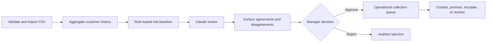

# Receivables Risk Manager — Step-by-Step Demo Guide

Use this guide for a reliable 8–10 minute product demo. It is written for a
presenter using Frappe Desk on `staging.local`, but the flow works on any site
with the app installed.

The story is simple:

> Raw invoice data becomes explainable risk, Claude challenges the rule engine,
> and a finance manager—not the AI—decides what the team should do.



## Demo outcome

By the end of the demo, the audience should understand that the app:

1. imports and validates receivables data;
2. aggregates invoice history into customer-level risk;
3. prioritizes overdue invoices with explainable rules;
4. asks Claude to review the rules using broader customer context;
5. surfaces disagreements instead of hiding them;
6. requires human approval before an action becomes operational; and
7. keeps an auditable collection workflow inside Frappe.

## Recommended demo mode

Use the **prepared-recording mode** for interviews, portfolio recordings, and
live presentations. Show completed import and AI Review Run records instead of
waiting for background jobs on camera.

| Segment | Target time | Screen |
| --- | ---: | --- |
| Problem and data | 1:00 | Completed Import Job, invoice list |
| Explainable risk | 2:00 | Customer Risk Overview, Invoice Collection Priority |
| AI review | 2:00 | Completed AI Review Run |
| Human decision | 2:00 | Disagreements, Collection Action |
| Operational follow-through | 1:30 | Workflow, queue, audit trail |
| Close | 0:30 | Dashboard or queue summary |

Do not make a live AI call the critical path of the demo. A small review can
finish quickly, but CLI startup and background-worker load are variable.

## Presenter preflight

Complete this at least 15 minutes before presenting.

### 1. Verify the site and background services

From the bench directory:

```bash
bench --site staging.local list-apps
bench --site staging.local doctor
bench --site staging.local scheduler status
```

Confirm all of the following:

- `receivable_risk_manager` appears in the installed-app list;
- at least one worker is online;
- the scheduler is active; and
- there is no import or AI job you intend to show stuck in `Queued`.

If the scheduler is disabled, enable it before the demo:

```bash
bench --site staging.local scheduler enable
```

If this is a development bench without a process manager, keep `bench start`
running in a separate terminal. The current local bench uses port `8001`, so
open `http://staging.local:8001` unless the process output shows another URL.

### 2. Choose stable records

**Do not trust any specific record ID written in this guide, including this
section after you've read it once.** `RIMJ-00035` and `AIRV-00013` were the
live anchors when an earlier draft of this section was written; both are now
dead — the batch was wiped by a later `demo_reset.sh` run, and the AI Review
Run's own record survives (run history is preserved by design) but every
Collection Action it created is gone. This is exactly the trap a reset-based
demo dataset creates: a Receivables Import Job or AI Review Run keeps
existing, keeps looking selectable, and returns nothing the moment you point a
new action at it.

Query for the real current state immediately before presenting, not from memory:

```bash
# The batch actually worth demoing -- most recent Completed import with live members:
bench --site staging.local mariadb -e "
SELECT bm.receivables_import_job, COUNT(*) FROM \`tabReceivables Batch Member\` bm
GROUP BY bm.receivables_import_job ORDER BY bm.receivables_import_job DESC LIMIT 1;"

# Whether a completed AI Review Run already exists against it, or you need to run one:
bench --site staging.local mariadb -e "
SELECT name, status, disagreed_with_rules FROM \`tabAI Review Run\`
WHERE receivables_import_job = '<batch from above>' ORDER BY creation DESC LIMIT 1;"

# Current Proposed count, not whatever number is written above:
bench --site staging.local mariadb -e "SELECT COUNT(*) FROM \`tabCollection Action\` WHERE status='Proposed';"
```

If no AI Review Run exists yet against the current batch, run one from Batch
Workflow → Run AI Review with a small `Limit Rows` well before presenting —
not live, per this guide's own recommendation above.

Do not use any import stuck in `Queued` as a demo anchor. They have no live
queue entries behind them — this app's own `reconcile_stuck_import_jobs`
maintenance task exists specifically to clean these up when a worker dies
mid-job, so a `Queued` record surviving past a few minutes means exactly that
happened.

### 3. Optional: create a fresh batch-tracked demo dataset

> **Warning:** this deletes the site's existing receivables, assessments,
> actions, audit logs, and batch membership before importing the sample. Never
> run it against a site containing valuable data.

```bash
cd apps/receivable_risk_manager
./scripts/demo_reset.sh staging.local local_data/demo_500_open.csv 2020-05-31
```

Use `demo_reset.sh`, not the older direct-import setup path, when the Batch
Workflow menu is part of the demo. The reset script records the batch-to-invoice
membership required by the AI review flow.

### 4. Prepare the presenter account and browser

- Use an account with `Accounts Manager` to approve or reject proposals.
- Add `Accounts User` if you will demonstrate `Mark as Contacted` or `Resolve`.
- Set browser zoom to 90% so the report columns fit.
- Use a 16:9 window and close unrelated tabs and notifications.
- Open the following records in tabs before the audience joins:
  - the completed import job;
  - the completed AI Review Run;
  - Customer Risk Overview;
  - Invoice Collection Priority; and
  - Collection Action Queue.

## Live demo script

### Step 1 — Frame the problem

**Say:**

> “An overdue-invoice list tells finance what is late, but not what deserves
> attention first. This app combines payment history, current exposure, and
> invoice aging to create an explainable collection workflow.”

Keep this under 20 seconds. Do not start with implementation details.

### Step 2 — Show the completed import

**Click:** Search → `Receivables Import Job` → open the prepared completed job.

Point to:

- `Status = Completed`;
- total, valid, and invalid row counts;
- created versus updated invoice counts; and
- `Recalculation Status = Completed`.

**Say:**

> “A finance user uploads a CSV, validates it, then queues the import. Repeating
> an import updates matching invoices instead of duplicating them, and the risk
> pipeline recalculates after the import.”

Open **Batch Workflow** briefly and show its four destinations: Run AI Review,
Review Proposals, Disagreements Only, and AI Review History. Do not start a new
review yet.

**Success check:** the job is completed and the Batch Workflow menu is visible.

**Screenshot to capture:** `screenshots/receivables-import-job-completed.png`.
Include the status, row counts, and Batch Workflow menu in one frame.

### Step 3 — Show normalized invoice data

**Click:** Search → `Receivables Invoice`.

Point to the external invoice ID, customer name, dates, amounts, and open/closed
state. Explain that these are analytical DocTypes rather than incomplete ERPNext
accounting documents.

**Say:**

> “The source rows are normalized into a purpose-built analytical model. The
> original IDs remain stable, while customer names are shown as readable titles.”


*Reference capture: imported invoice records in Frappe Desk.*

### Step 4 — Move from invoices to customer exposure

**Click:** Search → `Receivables Customer`.

Point to customer name, total invoices, open exposure, risk score, risk level,
and confidence. If some columns are off-screen, open one customer record instead
of horizontally scrolling for too long.

**Say:**

> “The app aggregates every customer's payment history and current exposure.
> That means a small overdue invoice can still matter when the same customer has
> a large portfolio of open debt.”


*Reference capture: customer-level aggregates generated from invoice history.*

### Step 5 — Explain the customer risk score

**Click:** Search → `Customer Risk Overview`.

For the current 498-row staging sample, set **Risk Level = Medium**. The sample
currently has 18 Medium-risk customers and no High-risk customers. On a full
dataset import, use **High** as shown in the historical reference capture below.

Point to:

- Risk Score and Risk Level;
- Open Amount;
- open versus closed invoice counts;
- late-payment rate and average delay, if visible; and
- the explanation column.

**Say:**

> “This is deliberately rule-based. A finance user can see the factors behind
> the score, and the thresholds and weights live in Risk Settings rather than a
> black-box model.”


*Historical full-dataset capture. Use Medium on the current small staging sample.*

### Step 6 — Prioritize individual invoices

**Click:** Search → `Invoice Collection Priority`.

Leave Risk Level blank to show Medium and High invoices, then set
**Minimum Days Overdue = 30**. Optionally choose `Immediate Follow-up` or
`Escalate Collection` under Suggested Action.

Point to due date, days overdue, customer risk contribution, invoice risk score,
and suggested action.

**Say:**

> “Customer risk gives context; invoice risk turns that context into a ranked
> daily workload. The recommendation is still a rule-engine baseline—not an
> instruction sent to a customer.”


*Reference capture: overdue invoices ranked by collection urgency.*

### Step 7 — Show the AI review as a recorded unit of work

**Click:** open the prepared completed `AI Review Run`.

Point to:

- assessments in scope and reviewed;
- proposed action versus proposed no action;
- agreements and disagreements;
- low-confidence fallbacks;
- actions created versus already existing; and
- error and failed-chunk counts.

**Say:**

> “Claude reviews the invoice together with the customer's wider history and
> challenges the rule recommendation. The run is human-triggered, batch-scoped,
> resumable, and counted, so we can see exactly what it reviewed.”

Then state the safety rule:

> “The rules are a floor. Claude can escalate a recommendation, but it cannot
> silently downgrade a rule-flagged debt. Low-confidence or malformed answers
> fall back to the rules, and every proposal still needs manager approval.”

Do not wait for a fresh AI run during the main demo. If the audience asks to see
the trigger, return to the completed import, choose **Batch Workflow → Run AI
Review**, show that the batch is prefilled, and stop before clicking Start Review.

**Screenshot to capture:** `screenshots/ai-review-run-completed.png`. Include the
run status and all result counters.

### Step 8 — Lead with disagreements

From the completed AI Review Run, click **Review Disagreements**. Alternatively,
use **Batch Workflow → Disagreements Only** from the completed import.

Verify that the visible rows match the chosen run or batch. For `AIRV-00013`,
the expected disagreement count is 9.

If the report does not retain the scoped filters, use the `Collection Action`
list and apply these filters manually:

- Status = `Proposed`;
- AI Review Run = the prepared run; and
- AI Agreed With Rules = `No`.

Point to Rule Said, AI Said, AI Confidence, and AI Reasoning.

**Say:**

> “Agreement is cheap. The valuable review surface is this short disagreement
> queue, where a finance manager can compare the rule, the AI recommendation,
> and the reasoning side by side.”

**Screenshot to capture:** `screenshots/ai-review-disagreements.png`. Capture at
least one row where Rule Said and AI Said differ.

### Step 9 — Demonstrate the human approval gate

Open one disposable `Proposed` Collection Action. Before changing it, point to:

- linked invoice and customer;
- action type and priority;
- rule and AI proposals;
- AI confidence and reasoning; and
- the drafted message, if present.

**Say:**

> “The system produces a proposal, not an autonomous customer interaction.
> Nothing is emailed or sent by this app.”

Click **Approve**. The status should change from `Proposed` to `Open`.

Only perform this mutation on a demo record. If the record must remain untouched,
show the Approve and Reject actions without clicking either.

**Success check:** an approved proposal becomes `Open`; a rejected one becomes
`Rejected` and no longer appears in the operational queue.

**Screenshot to capture:** `screenshots/collection-action-proposal.png`. Capture
the AI Review section and the Approve/Reject controls before changing the record.

### Step 10 — Show operational follow-through

With an approved `Open` action, demonstrate one routine transition:

1. click **Mark as Contacted**;
2. confirm the status becomes `Contacted`; and
3. show that the next actions are Record Promise to Pay, Escalate, or Resolve.

Explain the role boundary: an Accounts User can perform routine progress, while
an Accounts Manager is required for approval, rejection, and escalation.

Also explain the unattended behavior:

- stale approved actions produce a new escalation proposal;
- paid invoices automatically resolve stale actions; and
- neither path sends anything to the customer.

**Screenshot to capture:** `screenshots/collection-action-workflow.png`. Include
the current status and available workflow actions.

### Step 11 — Return to the collection queue

**Click:** Search → `Collection Action Queue`.

Use `Status = Open` to show the team's active workload. Sort or filter by High
priority and point out due date and risk score.

The checked-in screenshot below predates the AI-review columns and approval
gate. It remains useful as a reference for the operational queue, but replace it
after capturing the current UI.


*Legacy reference capture: approved actions appear as Open in the working queue.*

**Say:**

> “This is the daily work screen after decisions are approved. It converts risk
> analysis into owned, prioritized, auditable collection work.”

### Step 12 — Close on control, not novelty

If a current dashboard capture is available, open `Receivables Risk Dashboard`
and show the headline KPIs plus two chart metrics. Otherwise, remain on the
queue and summarize the workflow.

**Say:**

> “The differentiator is not that an AI can write a reminder. It is that the
> system combines deterministic risk, contextual AI review, explicit human
> approval, and operational follow-through without hiding who decided what.”

End there. Do not dilute the close with installation details.

**Screenshot to capture:** `screenshots/receivables-risk-dashboard.png`. Show
the KPI cards, one chart, and the Top Risky Customers table if they fit cleanly.

## Optional live-processing appendix

Use this only when an audience explicitly wants to see background processing.

### Live import

1. Create a new `Receivables Import Job`.
2. Attach a small CSV and set the As Of Date.
3. Save and click **Validate**.
4. Check the row counts and error summary.
5. Click **Import** and confirm.
6. Show `Queued`, then move to another tab while the worker processes it.
7. Return when the realtime notification reports completion.

If the job remains queued for more than a few minutes, stop this branch of the
demo and return to the prepared completed record. Do not troubleshoot Redis or
workers in front of the audience.

### Live AI review

1. Open a completed batch.
2. Choose **Batch Workflow → Run AI Review**.
3. Save the new run.
4. Set Limit Rows to 5–10.
5. Click **Start Review** and confirm the guardrail message.
6. Continue with another report while the worker processes the run.
7. Return only after its status becomes Completed.

## Screenshot capture plan

Use PNG, a consistent 16:9 viewport, and the same zoom level throughout.
Capture after data finishes loading and before opening menus that cover important
content.

| Filename | Status | Must show |
| --- | --- | --- |
| `receivables-invoice-list.png` | Existing | IDs and readable customer titles |
| `receivables-customer-list.png` | Existing | Aggregated customer rows |
| `customer-risk-overview.png` | Existing, full-dataset reference | Risk, exposure, invoice counts |
| `invoice-collection-priority.png` | Existing | Aging, customer risk, suggested action |
| `collection-action-queue.png` | Replace | Current AI columns and approved Open actions |
| `receivables-import-job-completed.png` | Needed | Completed status, counts, Batch Workflow menu |
| `ai-review-run-completed.png` | Needed | Scope, agreements, disagreements, fallbacks, errors |
| `ai-review-disagreements.png` | Needed | Rule Said versus AI Said plus reasoning |
| `collection-action-proposal.png` | Needed | AI fields and Approve/Reject actions |
| `collection-action-workflow.png` | Needed | Contacted state and next workflow actions |
| `receivables-risk-dashboard.png` | Needed | KPIs, chart, top-risk table |

Before publishing screenshots:

- remove browser chrome and unrelated Desk navigation where practical;
- make sure IDs and names belong to the public/synthetic demo dataset;
- avoid empty filters or loading indicators;
- keep currency and number formatting consistent across captures; and
- update this guide if a workflow label changes.

## Recovery lines for common demo failures

**A background job is still queued:**

> “This stage normally runs on a worker. I have a completed run prepared so we
> can focus on the decision workflow rather than wait for infrastructure.”

**The small sample has no High-risk customers:**

> “This sample is intentionally small. I’ll use Medium risk to demonstrate the
> same scoring and drill-down; the full dataset capture shows High-risk cases.”

**Claude disagrees with nothing in a fresh run:**

> “Disagreement frequency varies by sample. The important control is that every
> verdict is recorded and the rule baseline cannot be silently weakened.”

**A workflow button is missing:**

> “The action is role-gated. I’ll switch to the prepared manager account and
> continue from the saved proposal.”

## Final presenter checklist

- [ ] Stable completed import selected.
- [ ] Stable completed AI Review Run selected.
- [ ] At least one disagreement identified in advance.
- [ ] One disposable Proposed action identified.
- [ ] Accounts Manager and Accounts User roles verified.
- [ ] Worker online and scheduler active if any live job will be started.
- [ ] All report tabs preloaded.
- [ ] Notifications muted and browser zoom consistent.
- [ ] Demo kept under 10 minutes.
- [ ] Close emphasizes explainability, guardrails, approval, and auditability.
